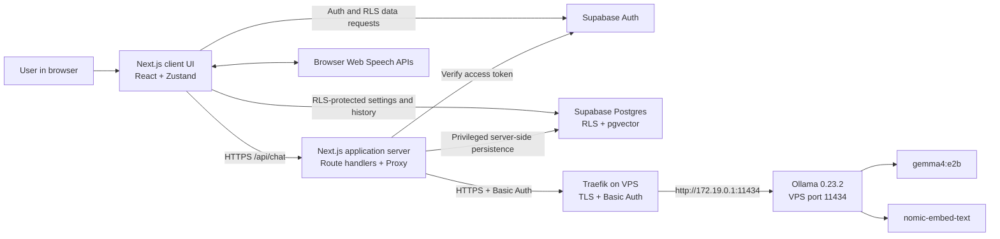
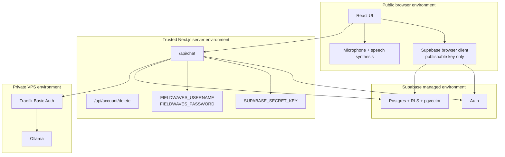
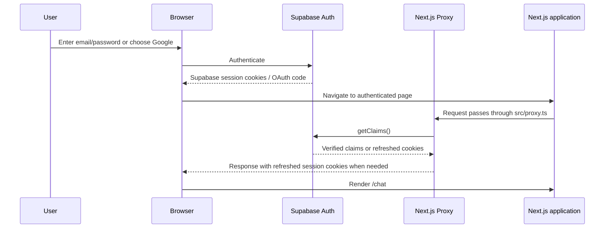
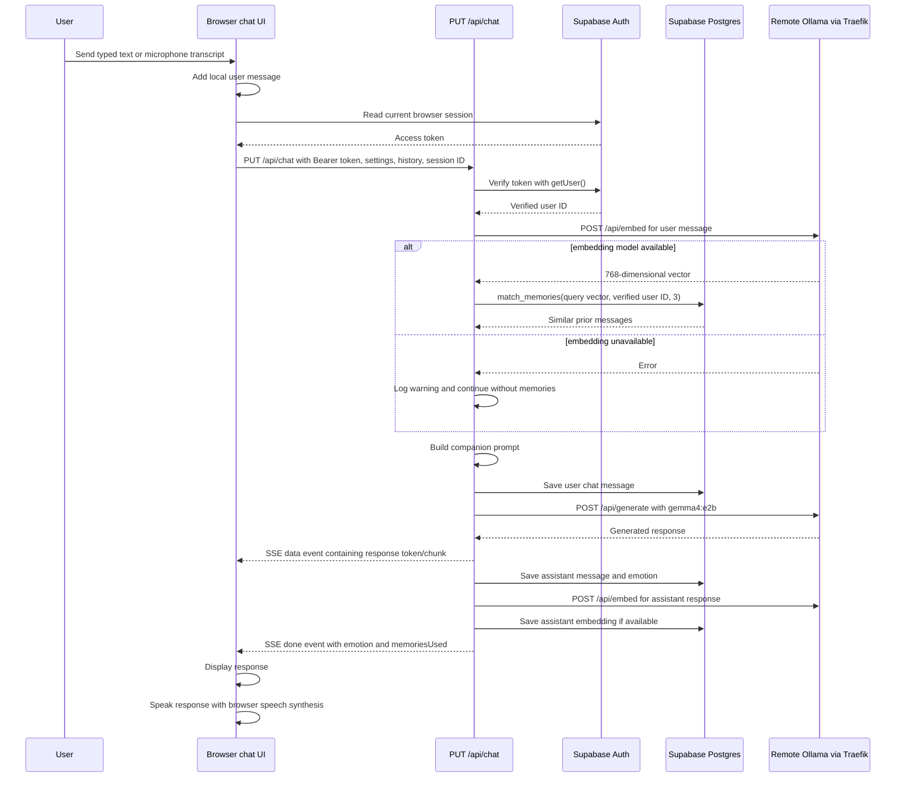
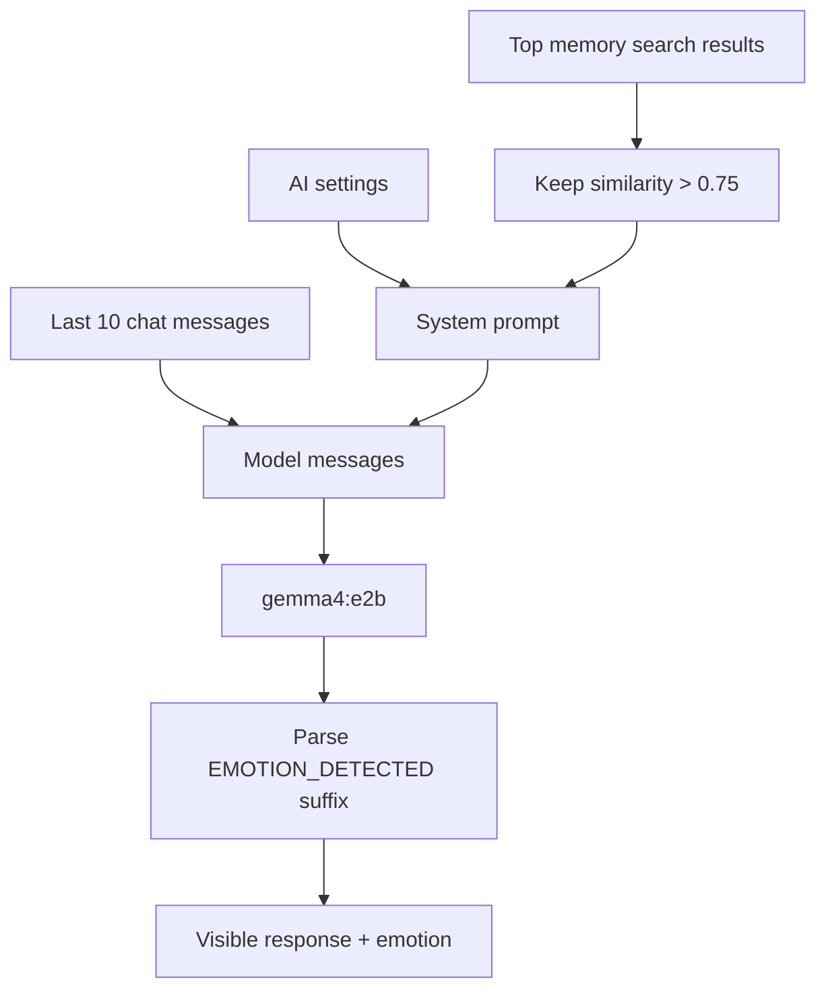
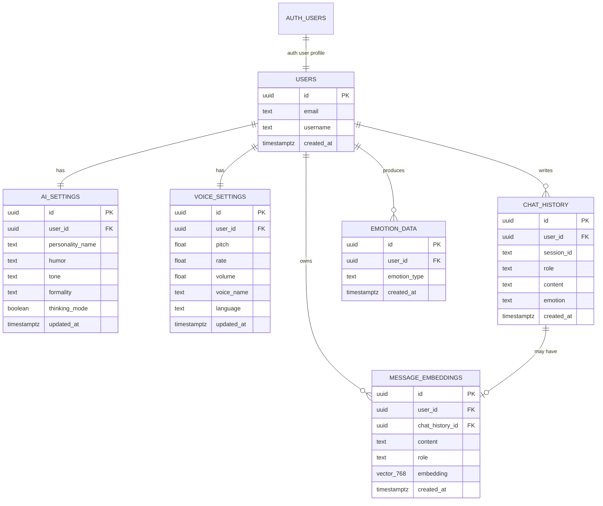
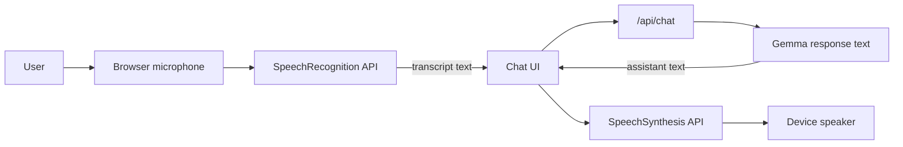
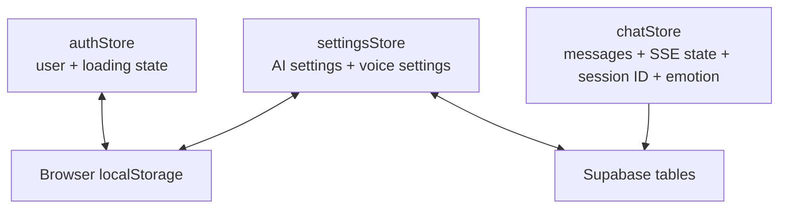

# AI Chat Companion: Architecture and Operations Guide

## Document purpose

This document describes the current implementation of the AI Chat Companion in
`voice-app`. It is intended to be the primary engineering handoff, deployment
reference, and troubleshooting guide for the project.

The application is a personalized browser-based AI companion with:

- Email/password and Google OAuth authentication through Supabase Auth.
- A configurable companion personality.
- AI-generated responses from Gemma 4 E2B running behind a private Ollama
  server.
- Long-term semantic memory stored in Supabase Postgres with `pgvector`.
- Emotion tagging derived from the user's message.
- Browser-based microphone input and browser-based text-to-speech output.
- Progressive Web App (PWA) metadata and generated service worker support.

## Verified state

The following behavior was manually verified on **May 31, 2026**:

| Component | Result | Notes |
| --- | --- | --- |
| Supabase Auth | Working | `/auth/v1/health` returned HTTP `200` and GoTrue `v2.189.0`. |
| Supabase application tables | Working | `chat_history`, `emotion_data`, `message_embeddings`, `ai_settings`, and `voice_settings` are reachable with the server key. |
| Supabase memory RPC | Working | `match_memories` accepted a 768-dimensional test vector and returned an empty result for a nonexistent user. |
| Traefik Basic Auth | Working | `https://ai.fieldwaves.com/api/tags` accepted the configured credentials. |
| Remote Ollama | Working | Ollama reported version `0.23.2`. |
| Remote chat model | Working | `gemma4:e2b` is installed and returned `Gemma is working` from `/api/generate`. |
| Embedding endpoint | API path fixed | The app now calls `/api/embed`, which is the current Ollama endpoint. |
| Embedding model | Requires VPS setup | `nomic-embed-text` was not installed when checked. Run `ollama pull nomic-embed-text` on the VPS. |
| Lint | Passing | `npm run lint` passes. |
| TypeScript | Passing | `npx tsc --noEmit` passes. |

Normal AI chat works without the embedding model because the streaming chat
route treats semantic memory recall as optional. Long-term memory search remains
disabled until `nomic-embed-text` is installed on the VPS.

## Stack summary

| Layer | Technology | Responsibility |
| --- | --- | --- |
| Web framework | Next.js `16.2.6` App Router | Pages, route handlers, Proxy, production build |
| UI runtime | React `19.2.4` | Interactive chat, auth forms, settings screens |
| Styling | Tailwind CSS `4` | Layout and visual styling |
| Local browser state | Zustand `5` | Auth projection, chat messages, settings |
| Authentication | Supabase Auth | Email/password login, signup, Google OAuth, access tokens |
| Database | Supabase Postgres | User settings, chat history, emotions, embeddings |
| Vector search | `pgvector` | Semantic memory similarity search |
| Browser SSR auth adapter | `@supabase/ssr` | Cookie storage and token refresh |
| Browser database client | `@supabase/supabase-js` | RLS-protected settings and history queries |
| AI inference server | Ollama `0.23.2` | Gemma response generation and embeddings |
| Chat model | `gemma4:e2b` | Companion responses |
| Embedding model | `nomic-embed-text` | 768-dimensional semantic memory vectors |
| AI reverse proxy | Traefik managed by Dokploy | HTTPS termination and Basic Auth |
| Voice input | Browser Web Speech API | Speech-to-text microphone capture |
| Voice output | Browser Speech Synthesis API | Text-to-speech output |
| PWA | `next-pwa` and web manifest | Installable application metadata and generated service worker |

## System context



### Trust boundaries



The publishable Supabase key is intentionally available to the browser. The
Supabase secret key and Fieldwaves Basic Auth password must remain server-only.
Never expose either secret through a `NEXT_PUBLIC_` variable.

## Repository layout

```text
voice-app/
├── src/
│   ├── app/
│   │   ├── (auth)/                 # Login and signup pages
│   │   ├── (main)/                 # Authenticated application pages
│   │   ├── api/
│   │   │   ├── account/delete/     # Verified account deletion endpoint
│   │   │   └── chat/               # AI chat route handlers
│   │   ├── auth/callback/          # OAuth PKCE code exchange
│   │   ├── layout.tsx              # Root HTML layout
│   │   └── page.tsx                # Redirects / to /chat
│   ├── components/
│   │   ├── chat/                   # Chat window, bubbles, input, microphone
│   │   ├── layout/                 # Navbar and sidebar
│   │   ├── personality/            # Personality presets
│   │   └── ui/                     # Shared UI primitives
│   ├── hooks/
│   │   ├── useAuth.ts              # Browser session projection
│   │   ├── useChat.ts              # Streaming chat client
│   │   ├── usePersonality.ts       # Personality persistence
│   │   └── useVoice.ts             # Browser speech controllers
│   ├── lib/
│   │   ├── ollama/                 # AI generation, embeddings, prompt builder
│   │   ├── supabase/               # Browser, server, Proxy, and DB helpers
│   │   ├── voice/                  # Speech-to-text and text-to-speech wrappers
│   │   └── utils.ts
│   ├── store/                      # Zustand stores
│   ├── types/                      # Shared TypeScript definitions
│   └── proxy.ts                    # Next.js 16 Proxy entry point
├── public/
│   ├── icons/
│   └── manifest.json
├── supabase/
│   └── schema.sql                  # Database schema and RLS policies
├── .env.example
├── next.config.ts
├── package.json
└── README.md
```

## Next.js application routes

| Route | Type | Purpose |
| --- | --- | --- |
| `/` | Server page | Redirects to `/chat`. |
| `/login` | Client page | Email/password login and Google OAuth entry point. |
| `/signup` | Client page | Email/password signup and Google OAuth entry point. |
| `/auth/callback` | Route handler | Exchanges an OAuth PKCE code for a Supabase session cookie. |
| `/chat` | Client page | Main companion chat UI with automatic voice output. |
| `/history` | Client page | Displays up to 50 persisted chat messages grouped by date. |
| `/personality` | Client page | Configures companion name, humor, tone, formality, and thinking mode. |
| `/voice-settings` | Client page | Configures browser voice, language, pitch, rate, and volume. |
| `/api/chat` | Route handler | Handles AI chat requests. `PUT` is used by the UI for streamed SSE delivery. |
| `/api/account/delete` | Route handler | Deletes the authenticated Supabase user through the server secret key. |

## Deployment topology

The application talks to Ollama through `https://ai.fieldwaves.com`. Ollama is
not directly exposed to the public internet. Traefik terminates TLS and requires
Basic Auth before forwarding traffic to the host Ollama service.

```mermaid
flowchart LR
    Next["Next.js server"]
    DNS["ai.fieldwaves.com"]
    Cloudflare["Cloudflare DNS / network"]
    Traefik["Dokploy Traefik container<br/>websecure entry point"]
    Auth["ollama-auth middleware<br/>bcrypt password verification"]
    Host["Docker host gateway<br/>172.19.0.1:11434"]
    Ollama["Ollama service"]

    Next -->|"HTTPS Basic Auth"| DNS
    DNS --> Cloudflare
    Cloudflare --> Traefik
    Traefik --> Auth
    Auth -->|"authorized request"| Host
    Host --> Ollama
```



### Traefik dynamic router

The VPS file `/etc/dokploy/traefik/dynamic/ollama-ai.yml` should contain:

```yaml
http:
  routers:
    ollama-router-web:
      rule: Host(`ai.fieldwaves.com`)
      service: ollama-service
      middlewares:
        - redirect-to-https
      entryPoints:
        - web
    ollama-router-websecure:
      rule: Host(`ai.fieldwaves.com`)
      service: ollama-service
      middlewares:
        - ollama-auth
      entryPoints:
        - websecure
      tls:
        certResolver: letsencrypt
  services:
    ollama-service:
      loadBalancer:
        servers:
          - url: http://172.19.0.1:11434
        passHostHeader: true
```

The VPS file `/etc/dokploy/traefik/dynamic/middlewares.yml` should contain:

```yaml
http:
  middlewares:
    ollama-auth:
      basicAuth:
        users:
          - "mardan:$2y$..."
    redirect-to-https:
      redirectScheme:
        scheme: https
        permanent: true
```

Traefik watches dynamic configuration files and normally reloads them after a
save. A restart is not normally required.

### Basic Auth password format

The password has two different representations:

| Location | Value format |
| --- | --- |
| Traefik `middlewares.yml` | Bcrypt hash, for example `mardan:$2y$...` |
| Application `.env` | Plaintext password, for example `FIELDWAVES_PASSWORD=...` |

Generate a new bcrypt entry on the VPS:

```bash
htpasswd -nB mardan
```

Type the new plaintext password twice. Replace the full generated line inside
`middlewares.yml`, then place only the plaintext password in the application
environment.

Test authentication:

```bash
curl -u "mardan:YOUR_PASSWORD" https://ai.fieldwaves.com/api/tags
```

Expected result: a JSON model list containing `gemma4:e2b`.

## Environment variables

Use `.env.local` for local development or configure the equivalent server
environment in the deployment platform.

| Variable | Exposure | Required | Purpose |
| --- | --- | --- | --- |
| `NEXT_PUBLIC_SUPABASE_URL` | Browser and server | Yes | Supabase project URL. |
| `NEXT_PUBLIC_SUPABASE_PUBLISHABLE_KEY` | Browser and server | Yes | Public Supabase key for browser auth and RLS-protected database access. |
| `SUPABASE_SECRET_KEY` | Server only | Yes | Privileged Supabase key for server-side persistence and account deletion. |
| `FIELDWAVES_API_URL` | Server only | Yes | Remote Ollama generation URL. Default: `https://ai.fieldwaves.com/api/generate`. |
| `FIELDWAVES_USERNAME` | Server only | Yes | Traefik Basic Auth username. |
| `FIELDWAVES_PASSWORD` | Server only | Yes | Traefik Basic Auth plaintext password. |
| `FIELDWAVES_MODEL` | Server only | Yes | Chat generation model. Default: `gemma4:e2b`. |
| `FIELDWAVES_EMBED_MODEL` | Server only | Yes for memory | Embedding model. Default: `nomic-embed-text`. |
| `OLLAMA_EMBED_MODEL` | Server only | Compatibility fallback | Legacy embedding model variable. Prefer `FIELDWAVES_EMBED_MODEL`. |

Example:

```dotenv
NEXT_PUBLIC_SUPABASE_URL=
NEXT_PUBLIC_SUPABASE_PUBLISHABLE_KEY=
SUPABASE_SECRET_KEY=

FIELDWAVES_API_URL=https://ai.fieldwaves.com/api/generate
FIELDWAVES_USERNAME=mardan
FIELDWAVES_PASSWORD=
FIELDWAVES_MODEL=gemma4:e2b
FIELDWAVES_EMBED_MODEL=nomic-embed-text
```

## Authentication architecture

### Browser session flow



### Why `src/proxy.ts` exists

Next.js 16 renamed the old Middleware file convention to **Proxy**. The project
therefore uses `src/proxy.ts`, not `middleware.ts`.

The Proxy:

1. Creates a request-scoped Supabase server client.
2. Reads all current auth cookies from the incoming request.
3. Calls `supabase.auth.getClaims()` to validate or refresh the session.
4. Copies refreshed cookies onto the response.
5. Copies Supabase no-cache headers onto the response so session cookies are not
   cached by a CDN or reverse proxy.

The implementation lives in:

- `src/proxy.ts`
- `src/lib/supabase/proxy.ts`

### Chat authorization

The browser sends the current Supabase access token in the `Authorization`
header when calling `/api/chat`.

```text
Authorization: Bearer <supabase-access-token>
```

The server does not trust a browser-provided user ID. It calls Supabase
`auth.getUser(accessToken)` and uses the verified returned user ID for all
database writes and memory queries.

This is important because `/api/chat` uses the privileged Supabase secret key
for persistence. Without server-side token verification, a malicious browser
could attempt to write chat history under another user's ID.

### Browser database authorization

Settings and history pages query Supabase directly from the browser using the
publishable key. Supabase RLS policies constrain rows to `auth.uid()`.

The browser key is not a secret. Database protection comes from:

- Authenticated user session cookies and JWTs.
- Postgres RLS policies.
- Server-side token verification on privileged routes.

## Chat request lifecycle

The UI uses `PUT /api/chat` and receives Server-Sent Events (SSE).



### SSE payloads

The streaming route emits events in this form:

```text
data: {"token":"partial or full response text"}

data: {"done":true,"emotion":"neutral","memoriesUsed":2}

```

If generation fails after streaming begins:

```text
data: {"error":"Fieldwaves AI failed: ..."}

```

The browser parses each `data:` block and appends received tokens to the latest
assistant message.

### Ollama NDJSON streaming

Ollama `/api/generate` returns newline-delimited JSON (NDJSON) chunks while a
response is being generated. The server-side AI client:

1. Explicitly requests `stream: true`.
2. Reads the remote response body incrementally.
3. Splits complete NDJSON lines from any unfinished remainder.
4. Parses each JSON line and extracts its `response` fragment.
5. Accumulates the complete answer for persistence.
6. Forwards each generated fragment through the existing SSE callback.

The browser therefore receives visible response text incrementally instead of
waiting for the complete Gemma response.

## AI prompt construction

`src/lib/ollama/promptBuilder.ts` builds the system prompt from:

- Companion name.
- Humor level.
- Tone.
- Formality.
- Optional thinking mode token.
- Relevant semantic memories with similarity greater than `0.75`.
- A required `EMOTION_DETECTED` suffix instruction.



The visible assistant content removes the model's final
`EMOTION_DETECTED: <emotion>` line. The parsed emotion is stored independently.

Allowed emotions:

```text
happy | sad | angry | anxious | neutral | excited
```

## Long-term semantic memory

### Memory behavior

Each user and assistant chat message may receive a 768-dimensional embedding.
The embedding is stored alongside message content in `message_embeddings`.

For a new user message:

1. Generate an embedding through Ollama `/api/embed`.
2. Query the `match_memories` Postgres function.
3. Retrieve up to three closest vectors for the verified user.
4. Include only results above `0.75` similarity in the system prompt.
5. Ask Gemma to use those facts naturally without explicitly announcing memory
   retrieval.

### Required VPS model

Install the embedding model on the VPS:

```bash
ollama pull nomic-embed-text
```

Test the endpoint:

```bash
curl -u "mardan:YOUR_PASSWORD" \
  -H "Content-Type: application/json" \
  -d '{"model":"nomic-embed-text","input":"health check"}' \
  https://ai.fieldwaves.com/api/embed
```

Expected result: JSON containing an `embeddings` array.

## Database schema

### Entity relationship diagram



### Table responsibilities

| Table | Responsibility |
| --- | --- |
| `public.users` | Application profile linked one-to-one to `auth.users`. |
| `public.ai_settings` | User-specific companion personality configuration. |
| `public.voice_settings` | User-specific browser speech output configuration. |
| `public.chat_history` | Persisted user and assistant messages grouped by session ID. |
| `public.emotion_data` | Historical emotion observations parsed from companion responses. |
| `public.message_embeddings` | Semantic vectors for long-term memory retrieval. |

### Vector index

`message_embeddings.embedding` uses `vector(768)` and an IVFFlat cosine index:

```sql
CREATE INDEX IF NOT EXISTS message_embeddings_embedding_idx
  ON public.message_embeddings
  USING ivfflat (embedding vector_cosine_ops)
  WITH (lists = 100);
```

The memory RPC ranks vectors using cosine distance:

```sql
1 - (embedding <=> query_embedding) AS similarity
```

### RLS policies

RLS is enabled on every public application table. Each policy constrains rows to
the authenticated user's ID:

| Table | Policy rule |
| --- | --- |
| `users` | `auth.uid() = id` |
| `ai_settings` | `auth.uid() = user_id` |
| `voice_settings` | `auth.uid() = user_id` |
| `chat_history` | `auth.uid() = user_id` |
| `emotion_data` | `auth.uid() = user_id` |
| `message_embeddings` | `auth.uid() = user_id` |

The server uses `SUPABASE_SECRET_KEY` when saving chat data. Those writes bypass
RLS intentionally, but only after `/api/chat` verifies the caller's Supabase
access token and derives the user ID server-side.

## Voice architecture

Voice is implemented entirely in the browser. The VPS does not generate audio
and does not receive microphone recordings.



### Voice input

`src/lib/voice/speechToText.ts` wraps:

```text
window.SpeechRecognition
window.webkitSpeechRecognition
```

Behavior:

- Uses the configured voice language, defaulting to `en-US`.
- Captures a single utterance.
- Enables interim results but sends only final transcript text.
- Resolves to an empty transcript for `no-speech`.
- Displays a browser-support message if recognition is unavailable.

The microphone button is implemented in `src/components/chat/MicButton.tsx`.

### Voice output

`src/lib/voice/textToSpeech.ts` wraps:

```text
window.speechSynthesis
SpeechSynthesisUtterance
```

Behavior:

- Speaks each completed assistant message automatically.
- Uses available voices installed or exposed by the user's browser and OS.
- Removes common Markdown formatting before speech.
- Supports configured voice name, language, pitch, rate, and volume.
- Cancels any prior speech before speaking a new response.

### Browser requirements

Voice support depends on the user's browser and device:

| Feature | Requirement |
| --- | --- |
| Microphone input | Browser support for Web Speech recognition and microphone permission |
| Text-to-speech | Browser support for speech synthesis and at least one system voice |
| Production microphone access | HTTPS origin |
| Recommended desktop browsers | Current Chrome or Edge |

The voice settings page includes a `Test voice` button for local browser
verification.

## State management

### Zustand stores



| Store | Persisted locally | Important fields |
| --- | --- | --- |
| `authStore` | Yes | `user`, `isLoading` |
| `chatStore` | No | `messages`, `isGenerating`, `sessionId`, `currentEmotion`, `memoriesUsed` |
| `settingsStore` | Yes | `aiSettings`, `voiceSettings` |

The persisted auth user is only a UI projection. Sensitive server operations
never authorize based on Zustand state.

## PWA behavior

`next-pwa` is enabled in production and disabled during development.

```ts
const withPWA = createPWA({
  dest: "public",
  register: true,
  skipWaiting: true,
  disable: process.env.NODE_ENV === "development",
});
```

The manifest declares:

- Application name: `AI Chat Companion`
- Start URL: `/chat`
- Display mode: `standalone`
- Portrait orientation
- 192px and 512px maskable PNG icons

Production builds generate service worker files under `public/`. Treat those
files as build artifacts unless the deployment strategy intentionally commits
them.

## Setup guide

### 1. Install dependencies

```bash
npm install
```

### 2. Configure environment

```bash
cp .env.example .env.local
```

Fill in all required values described in the environment table.

### 3. Create the Supabase schema

Run `supabase/schema.sql` against the Supabase project using the SQL editor or an
approved migration workflow.

### 4. Install VPS Ollama models

On the VPS:

```bash
ollama pull gemma4:e2b
ollama pull nomic-embed-text
ollama list
```

### 5. Verify Traefik access

```bash
curl -u "mardan:YOUR_PASSWORD" https://ai.fieldwaves.com/api/tags
```

### 6. Verify chat generation

```bash
curl -u "mardan:YOUR_PASSWORD" \
  -H "Content-Type: application/json" \
  -d '{"model":"gemma4:e2b","prompt":"Reply with exactly: Gemma is working"}' \
  https://ai.fieldwaves.com/api/generate
```

### 7. Verify embeddings

```bash
curl -u "mardan:YOUR_PASSWORD" \
  -H "Content-Type: application/json" \
  -d '{"model":"nomic-embed-text","input":"health check"}' \
  https://ai.fieldwaves.com/api/embed
```

### 8. Run locally

```bash
npm run dev
```

### 9. Run source checks

```bash
npm run lint
npx tsc --noEmit
npm run build
git diff --check
```

## Operational health checks

### Ollama model list

```bash
curl -u "mardan:YOUR_PASSWORD" https://ai.fieldwaves.com/api/tags
```

### Ollama version

```bash
curl -u "mardan:YOUR_PASSWORD" https://ai.fieldwaves.com/api/version
```

### Gemma generation

```bash
curl -u "mardan:YOUR_PASSWORD" \
  -H "Content-Type: application/json" \
  -d '{"model":"gemma4:e2b","prompt":"Say ready"}' \
  https://ai.fieldwaves.com/api/generate
```

### Embedding generation

```bash
curl -u "mardan:YOUR_PASSWORD" \
  -H "Content-Type: application/json" \
  -d '{"model":"nomic-embed-text","input":"Say ready"}' \
  https://ai.fieldwaves.com/api/embed
```

### Traefik logs

Find the Traefik container:

```bash
docker ps --format '{{.Names}}' | grep -i traefik
```

Read recent logs:

```bash
docker logs --tail 100 dokploy-traefik
```

Only restart Traefik if dynamic config reload and logs indicate it is necessary:

```bash
docker restart dokploy-traefik
```

## Troubleshooting matrix

| Symptom | Likely cause | Resolution |
| --- | --- | --- |
| `401 Unauthorized` from `ai.fieldwaves.com` | `.env` plaintext password does not match Traefik bcrypt hash | Generate a new hash with `htpasswd -nB mardan`, update `middlewares.yml`, and set the same plaintext password in `.env`. |
| `/api/tags` works but `/api/generate` says model not found | Gemma model is absent on VPS | Run `ollama pull gemma4:e2b`. |
| Chat works but memory count always remains zero | Embedding model absent or embedding request fails | Run `ollama pull nomic-embed-text`, then test `/api/embed`. |
| `/api/embed` returns model not found | `nomic-embed-text` is not installed | Pull the model on the VPS. |
| `/api/embeddings` returns `404` | Old Ollama endpoint | Use `/api/embed` with an `input` field. The app source has been updated accordingly. |
| User appears randomly logged out | Session refresh Proxy is missing or cookie forwarding is broken | Confirm `src/proxy.ts` is built and `src/lib/supabase/proxy.ts` forwards cookies and headers. |
| Build reports `ƒ Proxy (Middleware)` missing | Next.js does not detect Proxy | Confirm `src/proxy.ts` exists at the same level as `src/app`. |
| Microphone button says unsupported | Browser lacks Web Speech recognition support | Use current Chrome or Edge and confirm HTTPS plus microphone permission. |
| Voice output is silent | Browser synthesis voice unavailable, muted device, or browser speech error | Open `/voice-settings`, select a voice, and use `Test voice`. |
| Google OAuth returns to login | Callback URL or Supabase provider configuration is incorrect | Confirm `/auth/callback` is allowed in Supabase Auth redirect URLs. |
| Supabase requests fail after the project was paused | Supabase project has not resumed fully | Wait for resume completion and check `/auth/v1/health` with the publishable key. |
| Build fails while fetching Google Fonts | Restricted network environment | Allow network access during `npm run build` or self-host fonts in a future hardening pass. |

## Security checklist

### Implemented protections

- Browser code receives only the Supabase publishable key.
- `SUPABASE_SECRET_KEY` remains server-only.
- Fieldwaves Basic Auth credentials remain server-only.
- Ollama sits behind Traefik HTTPS and Basic Auth.
- Chat requests verify the caller's Supabase token server-side.
- Chat persistence uses the verified token-derived user ID.
- Account deletion verifies the caller's token server-side.
- Public database tables have RLS enabled.
- Session refresh responses forward no-cache headers.

### Important operating rules

- Never prefix the Supabase secret key with `NEXT_PUBLIC_`.
- Never prefix `FIELDWAVES_PASSWORD` with `NEXT_PUBLIC_`.
- Never commit `.env`, `.env.local`, or plaintext passwords.
- Never place the plaintext Fieldwaves password inside Traefik YAML.
- Never place the bcrypt hash inside the application `.env`.
- Rotate the Fieldwaves password if it is pasted into a public issue, shared
  log, or committed file.
- Keep Supabase Auth redirect URLs restricted to trusted origins.
- Keep Ollama inaccessible except through the authenticated Traefik router.

## Known limitations and recommended improvements

### Priority 1: install and verify embeddings

Run:

```bash
ollama pull nomic-embed-text
```

Then test `/api/embed`. This enables long-term semantic memory.

### Priority 2: add automated route tests

Add tests for:

- Missing chat access token returns `401`.
- Invalid chat access token returns `401`.
- Browser-provided user ID cannot override verified identity.
- Embedding failure does not prevent chat generation.
- SSE generation errors reach the browser as `{ "error": "..." }`.
- OAuth callback writes cookies and redirects correctly.

### Priority 3: validate request payloads structurally

`/api/chat` currently performs a minimal manual body check. Add a schema
validator such as Zod for:

- Maximum message length.
- Maximum history length.
- Allowed personality values.
- Session ID format.
- Rejection of oversized or malformed payloads.

### Priority 4: add rate limiting

Protect `/api/chat` against accidental and abusive request volume. Consider:

- Per-user request limits.
- Concurrent generation limit per user.
- Maximum prompt size.
- Request timeout and cancellation.

### Priority 5: improve database constraints

Consider adding:

- Check constraints for allowed emotion values.
- Check constraints for voice pitch, rate, and volume ranges.
- Check constraints for AI setting enums.
- Explicit `WITH CHECK` clauses for RLS update and insert policies.
- A migration-based schema workflow instead of applying a single schema file
  manually.

### Priority 6: improve observability

Add structured server logs for:

- Auth verification failures.
- Ollama latency and cold starts.
- Embedding latency.
- Memory RPC latency and recalled memory count.
- Supabase persistence errors.
- SSE disconnects.

Do not log access tokens, Basic Auth passwords, or full private chat content.

### Priority 7: improve voice portability

Browser speech recognition support varies. For broader support, consider a
server-backed speech-to-text provider as an optional fallback. Keep the browser
speech path because it minimizes cost and avoids sending microphone recordings
to the server when supported.

## Source reference map

| Concern | Source file |
| --- | --- |
| Next.js Proxy entry point | `src/proxy.ts` |
| Supabase cookie refresh | `src/lib/supabase/proxy.ts` |
| Supabase browser client | `src/lib/supabase/client.ts` |
| Supabase privileged server client | `src/lib/supabase/server.ts` |
| Browser Supabase database helpers | `src/lib/supabase/db.ts` |
| Server persistence helpers | `src/lib/supabase/db-server.ts` |
| Chat route | `src/app/api/chat/route.ts` |
| Chat browser hook | `src/hooks/useChat.ts` |
| AI generation client | `src/lib/ollama/client.ts` |
| Embedding client | `src/lib/ollama/embeddings.ts` |
| Prompt builder and emotion parser | `src/lib/ollama/promptBuilder.ts` |
| Speech-to-text | `src/lib/voice/speechToText.ts` |
| Text-to-speech | `src/lib/voice/textToSpeech.ts` |
| Voice hook | `src/hooks/useVoice.ts` |
| Database schema | `supabase/schema.sql` |
| PWA configuration | `next.config.ts` |
| Web app manifest | `public/manifest.json` |

## Quick recovery procedure

If AI chat stops working:

1. Check Supabase status and resume the project if paused.
2. Check Traefik credentials:

   ```bash
   curl -u "mardan:YOUR_PASSWORD" https://ai.fieldwaves.com/api/tags
   ```

3. Confirm `gemma4:e2b` appears in the model list.
4. Send a direct Gemma test request:

   ```bash
   curl -u "mardan:YOUR_PASSWORD" \
     -H "Content-Type: application/json" \
     -d '{"model":"gemma4:e2b","prompt":"Say ready"}' \
     https://ai.fieldwaves.com/api/generate
   ```

5. Check embeddings independently:

   ```bash
   curl -u "mardan:YOUR_PASSWORD" \
     -H "Content-Type: application/json" \
     -d '{"model":"nomic-embed-text","input":"health check"}' \
     https://ai.fieldwaves.com/api/embed
   ```

6. Check Traefik logs if public AI requests fail before reaching Ollama.
7. Run local checks:

   ```bash
   npm run lint
   npx tsc --noEmit
   npm run build
   ```

This procedure isolates Supabase, Traefik authentication, Gemma inference,
embedding inference, and application source failures independently.
