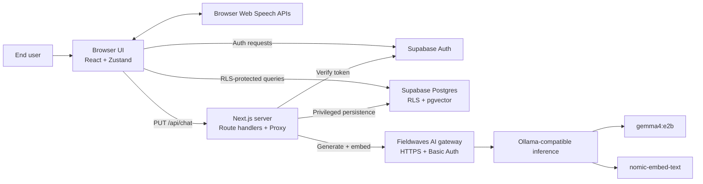
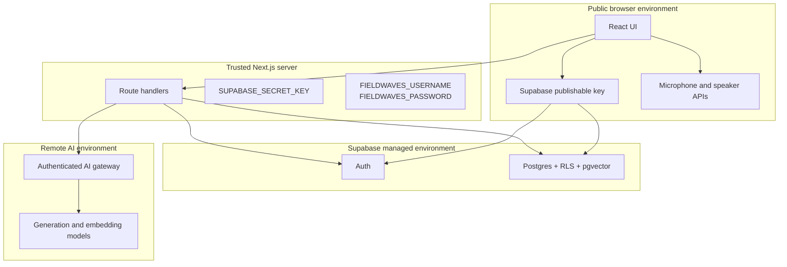
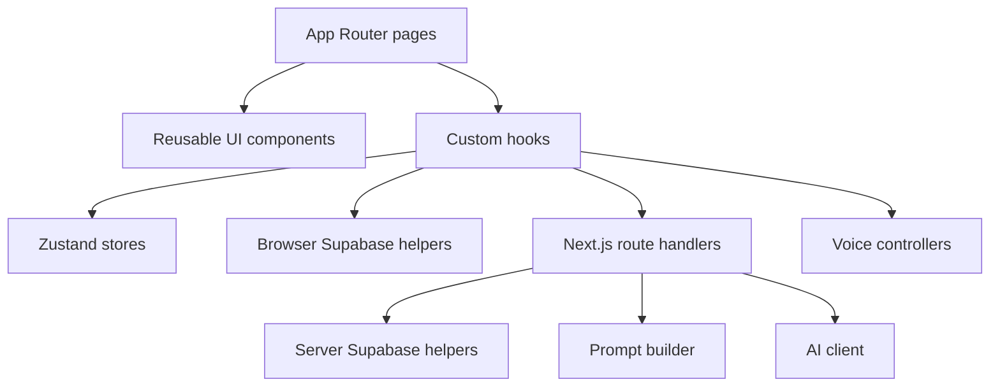
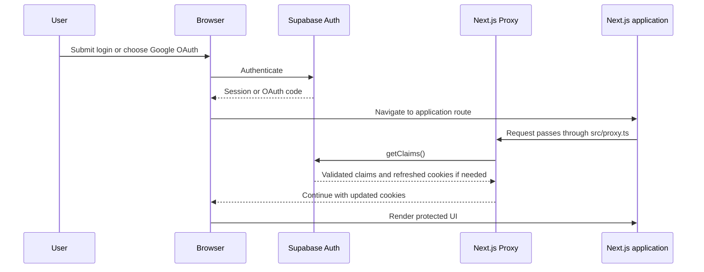
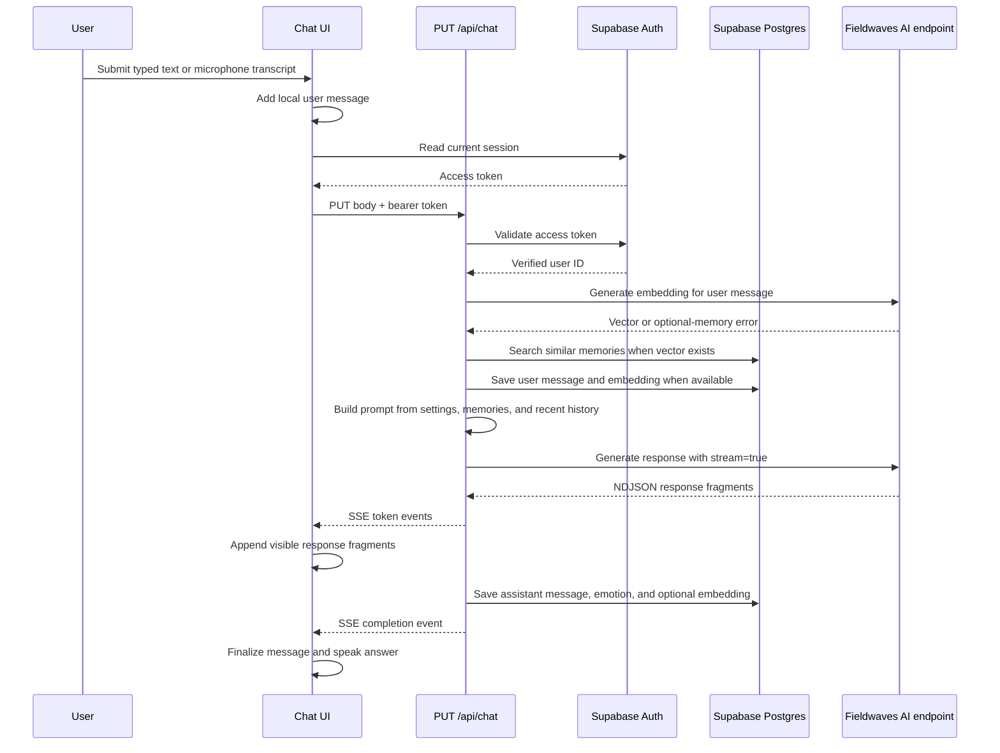
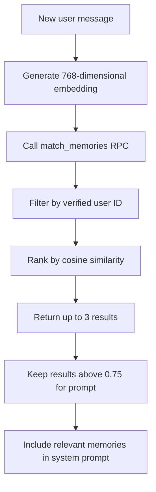
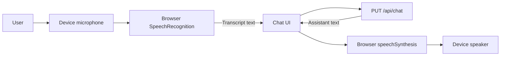
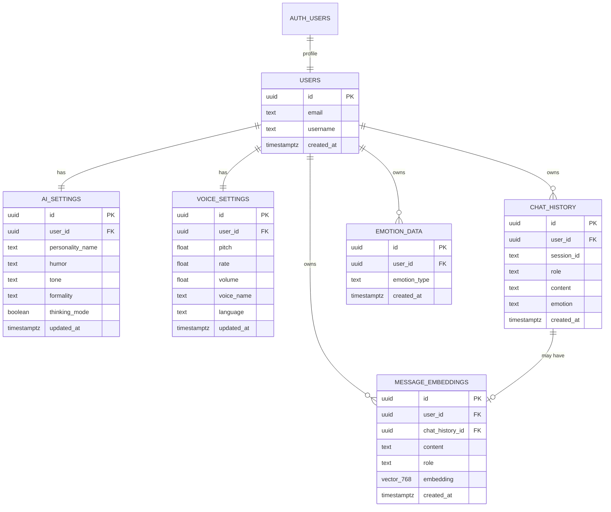
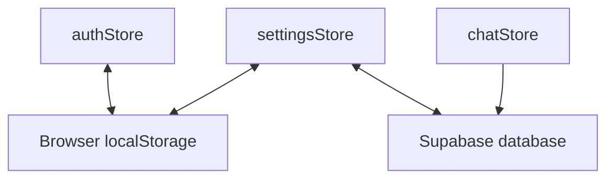

# AI Chat Companion

> A personalized, voice-enabled AI companion with streaming responses, configurable personality, emotion tagging, and long-term semantic memory.

## Software Requirements Specification and Technical Documentation

| Document field | Value |
| --- | --- |
| Project | AI Chat Companion |
| Project type | Full-stack web application / Progressive Web App |
| Primary purpose | University project presentation and engineering reference |
| Current implementation | Next.js App Router application with Supabase and a remote Ollama-compatible AI service |
| Document status | Based on the repository implementation as of June 1, 2026 |
| Detailed operations guide | [`ARCHITECTURE.md`](./ARCHITECTURE.md) |

---

## Table of Contents

1. [Executive Summary](#1-executive-summary)
2. [Problem Statement](#2-problem-statement)
3. [Project Objectives](#3-project-objectives)
4. [Project Scope](#4-project-scope)
5. [Stakeholders and User Roles](#5-stakeholders-and-user-roles)
6. [Functional Requirements](#6-functional-requirements)
7. [Non-Functional Requirements](#7-non-functional-requirements)
8. [Use Cases](#8-use-cases)
9. [System Architecture](#9-system-architecture)
10. [Technology Stack](#10-technology-stack)
11. [Repository Structure](#11-repository-structure)
12. [Application Routes](#12-application-routes)
13. [Authentication and Authorization](#13-authentication-and-authorization)
14. [AI Chat Pipeline](#14-ai-chat-pipeline)
15. [Long-Term Semantic Memory](#15-long-term-semantic-memory)
16. [Emotion Detection](#16-emotion-detection)
17. [Voice Features](#17-voice-features)
18. [Database Design](#18-database-design)
19. [State Management](#19-state-management)
20. [Progressive Web App Support](#20-progressive-web-app-support)
21. [Environment Variables](#21-environment-variables)
22. [Installation and Setup](#22-installation-and-setup)
23. [Testing and Verification](#23-testing-and-verification)
24. [Security Design](#24-security-design)
25. [Current Limitations](#25-current-limitations)
26. [Future Enhancements](#26-future-enhancements)
27. [Presentation Guide](#27-presentation-guide)
28. [Glossary](#28-glossary)
29. [Source Reference Map](#29-source-reference-map)

---

## 1. Executive Summary

AI Chat Companion is a browser-based conversational application designed to provide a more personal experience than a basic chatbot. A user can create an account, select a companion personality, send typed or spoken messages, receive streamed AI responses, hear responses spoken aloud, inspect prior conversations, and retain useful context across conversations through semantic memory.

The application is implemented as a full-stack Next.js 16 project. The browser interface is built with React and Tailwind CSS. Supabase provides authentication and a PostgreSQL database. The PostgreSQL `pgvector` extension stores message embeddings and retrieves semantically similar past messages. The Next.js server communicates with a remote Ollama-compatible inference service through the Fieldwaves AI endpoint. Browser-native Web Speech APIs provide speech-to-text and text-to-speech functionality.

The design intentionally separates public browser responsibilities from trusted server responsibilities:

- The browser handles presentation, user interaction, local UI state, Supabase login, and browser speech APIs.
- The Next.js server validates access tokens, protects privileged secrets, builds AI prompts, streams responses, and persists server-side chat data.
- Supabase stores user data and enforces Row Level Security (RLS).
- The AI service generates text and vector embeddings.

### Key capabilities

- Email/password signup and login.
- Google OAuth entry points and callback handling.
- Email confirmation callback handling.
- Configurable AI personality.
- Streaming AI responses using Server-Sent Events (SSE).
- Emotion classification for each assistant response.
- Long-term semantic memory using 768-dimensional embeddings.
- Voice input through browser speech recognition.
- Voice output through browser speech synthesis.
- Conversation history.
- Account deletion.
- PWA manifest and production service-worker generation.

---

## 2. Problem Statement

Traditional chatbot interfaces often have four limitations:

1. They treat every conversation as an isolated interaction.
2. They provide the same communication style to every user.
3. They rely only on keyboard input and text output.
4. They provide little emotional context or personalization.

AI Chat Companion addresses these limitations by combining conversational AI with user-specific personality settings, persistent semantic memory, emotion tagging, and voice interaction. The result is an application that can provide more natural and context-aware conversations while maintaining a clear separation between public and private data.

---

## 3. Project Objectives

### 3.1 Primary objectives

| ID | Objective |
| --- | --- |
| OBJ-01 | Provide a secure account-based AI chat experience. |
| OBJ-02 | Stream AI-generated responses so the interface feels responsive during generation. |
| OBJ-03 | Allow each user to customize the personality of their AI companion. |
| OBJ-04 | Store prior messages and retrieve semantically relevant memories during future conversations. |
| OBJ-05 | Support speech input and spoken output without requiring a separate mobile application. |
| OBJ-06 | Store emotion observations for later analysis and user experience improvements. |
| OBJ-07 | Use a modular architecture that can be explained, maintained, and extended. |

### 3.2 Academic objectives

The project demonstrates:

- Full-stack TypeScript application development.
- Authentication and authorization.
- Database modeling and foreign-key relationships.
- PostgreSQL Row Level Security.
- Vector databases and semantic search.
- AI model integration.
- Streaming HTTP responses.
- Browser APIs for voice interaction.
- Progressive Web App concepts.
- Security boundaries between browser and server code.

---

## 4. Project Scope

### 4.1 In scope

The current repository includes:

- Browser-based account creation and login.
- Google OAuth initiation and callback route.
- Email-confirmation verification route.
- Protected main application layout.
- Text chat with streamed AI responses.
- Personality configuration.
- Voice settings.
- Browser microphone input.
- Automatic speech synthesis after an AI response completes.
- Persistent chat history.
- Persistent emotion data.
- Semantic memory lookup and persistence when the embedding service is available.
- Account deletion through a protected server route.
- PWA metadata and icons.

### 4.2 Out of scope

The current repository does not include:

- Native Android or iOS applications.
- Multi-user group chat.
- File uploads or image analysis.
- Administrator dashboard.
- Push notifications.
- Offline AI generation.
- Server-hosted speech recognition.
- Server-hosted speech synthesis.
- Automated end-to-end test suite.
- Rate limiting.
- A completed automated database bootstrap trigger for new user profiles.

### 4.3 System boundary

The application depends on three external systems:

| External system | Role |
| --- | --- |
| Supabase | Authentication, PostgreSQL storage, RLS, and vector search RPC |
| Fieldwaves AI endpoint | Authenticated HTTP gateway to Ollama-compatible text generation and embeddings |
| Browser Web Speech APIs | Speech recognition and speech synthesis on supported devices |

---

## 5. Stakeholders and User Roles

| Stakeholder | Interest in the system |
| --- | --- |
| End user | Wants a personalized AI companion with memory and voice interaction. |
| Developer | Maintains the Next.js application, database schema, and integrations. |
| System operator | Configures environment variables, Supabase, the AI service, models, and reverse proxy. |
| University evaluator | Reviews the software requirements, architecture, implementation choices, and limitations. |

### User roles

| Role | Permissions |
| --- | --- |
| Visitor | Can access login and signup pages. |
| Authenticated user | Can chat, view personal history, edit settings, use voice features, and delete their account. |
| Server application | Can use the Supabase secret key after verifying the caller's access token. |

The project does not currently define an administrator role inside the application UI.

---

## 6. Functional Requirements

### 6.1 Authentication requirements

| ID | Requirement | Current status |
| --- | --- | --- |
| FR-AUTH-01 | The system shall allow a visitor to create an account using email, password, and username. | Implemented |
| FR-AUTH-02 | The system shall allow a registered user to log in using email and password. | Implemented |
| FR-AUTH-03 | The system shall provide a Google OAuth login option. | Implemented; provider configuration is required in Supabase |
| FR-AUTH-04 | The system shall support email-confirmation links. | Implemented through `/auth/confirm` |
| FR-AUTH-05 | The system shall refresh or validate browser auth cookies through the Next.js Proxy layer. | Implemented |
| FR-AUTH-06 | The system shall redirect unauthenticated users away from protected application pages. | Implemented in the client layout |
| FR-AUTH-07 | The system shall allow an authenticated user to log out. | Implemented |
| FR-AUTH-08 | The system shall allow an authenticated user to delete their account. | Implemented |

### 6.2 Chat requirements

| ID | Requirement | Current status |
| --- | --- | --- |
| FR-CHAT-01 | The system shall allow an authenticated user to submit a text message. | Implemented |
| FR-CHAT-02 | The system shall reject an empty message. | Implemented |
| FR-CHAT-03 | The system shall validate the caller's Supabase access token before generating a response. | Implemented |
| FR-CHAT-04 | The system shall stream generated response fragments to the browser. | Implemented using SSE |
| FR-CHAT-05 | The browser shall display streamed fragments incrementally. | Implemented |
| FR-CHAT-06 | The system shall persist the user's message. | Implemented |
| FR-CHAT-07 | The system shall persist the assistant's completed response. | Implemented |
| FR-CHAT-08 | The chat prompt shall include up to ten recent in-memory messages. | Implemented |
| FR-CHAT-09 | The system shall display a visible error response if chat generation fails. | Implemented |
| FR-CHAT-10 | The user shall be able to start a fresh local chat session. | Store support exists; no current UI button |

### 6.3 Personality requirements

| ID | Requirement | Current status |
| --- | --- | --- |
| FR-PERS-01 | The user shall be able to set a companion name. | Implemented |
| FR-PERS-02 | The user shall be able to configure humor level. | Implemented |
| FR-PERS-03 | The user shall be able to configure tone. | Implemented |
| FR-PERS-04 | The user shall be able to configure formality. | Implemented |
| FR-PERS-05 | The user shall be able to enable or disable thinking mode. | Implemented |
| FR-PERS-06 | The user shall be able to choose a predefined personality preset. | Implemented |
| FR-PERS-07 | Personality settings shall be stored per user. | Implemented when the user's settings row exists |

Available presets:

| Preset | Intended behavior |
| --- | --- |
| Friendly Helper | Warm, supportive, lightly humorous, and casual |
| Tech Expert | Precise, technical, professional, and formal |
| Creative Companion | Playful, imaginative, humorous, and casual |

### 6.4 Memory requirements

| ID | Requirement | Current status |
| --- | --- | --- |
| FR-MEM-01 | The system shall generate an embedding for a new user message when the embedding service is available. | Implemented |
| FR-MEM-02 | The system shall retrieve up to three semantically similar memories for the authenticated user. | Implemented |
| FR-MEM-03 | The system shall include only memories above the prompt relevance threshold. | Implemented; threshold is `0.75` |
| FR-MEM-04 | The system shall store message embeddings for later retrieval. | Implemented |
| FR-MEM-05 | A failure in optional memory retrieval shall not prevent streamed chat generation. | Implemented in `PUT /api/chat` |
| FR-MEM-06 | Memory retrieval shall never search another user's records. | Implemented by filtering with the verified user ID |

### 6.5 Emotion requirements

| ID | Requirement | Current status |
| --- | --- | --- |
| FR-EMO-01 | The AI response shall include an emotion classification based on the user's message. | Implemented through prompt instructions |
| FR-EMO-02 | The server shall parse the classification from the generated response. | Implemented |
| FR-EMO-03 | The visible assistant response shall hide the internal emotion suffix. | Implemented |
| FR-EMO-04 | The system shall store parsed emotion observations. | Implemented |
| FR-EMO-05 | The chat UI shall show the latest emotion. | Implemented |

Supported emotion values:

```text
happy | sad | angry | anxious | neutral | excited
```

### 6.6 Voice requirements

| ID | Requirement | Current status |
| --- | --- | --- |
| FR-VOICE-01 | The user shall be able to start microphone input from the chat page. | Implemented on supported browsers |
| FR-VOICE-02 | The system shall convert a completed spoken utterance into a text chat message. | Implemented |
| FR-VOICE-03 | The application shall speak completed AI responses aloud. | Implemented |
| FR-VOICE-04 | The user shall be able to choose a browser-provided voice. | Implemented |
| FR-VOICE-05 | The user shall be able to configure language, pitch, speed, and volume. | Implemented |
| FR-VOICE-06 | The voice settings page shall provide a test action. | Implemented |

### 6.7 History and account requirements

| ID | Requirement | Current status |
| --- | --- | --- |
| FR-HIST-01 | The system shall persist chat messages with timestamps. | Implemented |
| FR-HIST-02 | The system shall show recent persisted messages to the authenticated user. | Implemented; limit is 50 |
| FR-HIST-03 | The history page shall group messages by date. | Implemented |
| FR-ACC-01 | Account deletion shall require a valid access token. | Implemented |
| FR-ACC-02 | Deleting the Supabase auth user shall cascade to application records linked by foreign keys. | Designed in schema |

---

## 7. Non-Functional Requirements

| ID | Category | Requirement | Implementation note |
| --- | --- | --- | --- |
| NFR-01 | Security | Privileged credentials shall remain server-only. | `SUPABASE_SECRET_KEY` and `FIELDWAVES_PASSWORD` do not use the `NEXT_PUBLIC_` prefix. |
| NFR-02 | Privacy | One user shall not access another user's rows. | Supabase RLS policies constrain rows using `auth.uid()`. |
| NFR-03 | Responsiveness | AI output should appear progressively during generation. | The API converts upstream NDJSON chunks into SSE events. |
| NFR-04 | Availability | Chat should continue if optional semantic-memory generation fails. | The streamed route catches embedding and memory-search errors. |
| NFR-05 | Maintainability | Application responsibilities should be separated into small modules. | Hooks, stores, route handlers, and service clients are separated by concern. |
| NFR-06 | Portability | The UI should work in a modern browser without installing a native application. | Implemented as a web application with PWA metadata. |
| NFR-07 | Accessibility | Text chat should remain available when speech APIs are unsupported. | Voice input is optional and the typed input remains available. |
| NFR-08 | Data integrity | User-owned application rows should be deleted with their account. | Foreign keys use `ON DELETE CASCADE`. |
| NFR-09 | Scalability | Memory lookup should use a vector index rather than scanning all messages. | `message_embeddings` uses an IVFFlat cosine index. |
| NFR-10 | Deployability | Environment-specific credentials shall be configured outside source code. | `.env.example` documents required variables. |

---

## 8. Use Cases

### UC-01: Create an account

| Field | Description |
| --- | --- |
| Actor | Visitor |
| Preconditions | The visitor is not logged in. Supabase Auth is configured. |
| Main flow | The visitor opens `/signup`, enters username, email, and matching passwords, then submits the form. The browser calls Supabase Auth signup. If email confirmation is enabled, the UI asks the user to check their email. |
| Alternative flow | The visitor chooses Google login and is redirected through the OAuth provider. |
| Postcondition | A Supabase auth account exists. Application profile initialization must also be configured; see [Current Limitations](#25-current-limitations). |

### UC-02: Log in

| Field | Description |
| --- | --- |
| Actor | Registered user |
| Preconditions | The account exists and is eligible to log in. |
| Main flow | The user enters email and password at `/login`. Supabase returns a session. The app redirects to `/chat`. |
| Alternative flow | The user chooses Google login and returns through `/auth/callback`. |
| Postcondition | The browser holds a Supabase session and can use protected features. |

### UC-03: Send a streamed chat message

| Field | Description |
| --- | --- |
| Actor | Authenticated user |
| Preconditions | A valid Supabase session exists. The Fieldwaves AI endpoint is reachable. |
| Main flow | The user submits text. The browser obtains the current access token and sends `PUT /api/chat`. The server validates the token, optionally searches memories, saves the user message, calls the AI service, emits SSE fragments, persists the assistant answer, stores emotion data, and emits a final SSE event. |
| Alternative flow | If embeddings fail, generation continues without semantic memories. |
| Failure flow | If token validation or AI generation fails, the user sees an error message. |

### UC-04: Send a voice message

| Field | Description |
| --- | --- |
| Actor | Authenticated user |
| Preconditions | The browser supports speech recognition and microphone permission is granted. |
| Main flow | The user clicks `Use mic`, speaks, and stops. The browser converts final transcript text into a normal chat submission. |
| Postcondition | The transcript follows the same pipeline as typed text. |

### UC-05: Change companion personality

| Field | Description |
| --- | --- |
| Actor | Authenticated user |
| Preconditions | A matching `ai_settings` row exists. |
| Main flow | The user opens `/personality`, selects a preset or custom fields, and clicks `Save`. The browser updates the user's RLS-protected database row. |
| Postcondition | Future prompts use the updated settings. |

### UC-06: Review history

| Field | Description |
| --- | --- |
| Actor | Authenticated user |
| Preconditions | The user has persisted chat messages. |
| Main flow | The user opens `/history`. The browser queries the user's latest 50 chat rows and groups them by date. |
| Postcondition | The user can review prior messages and stored emotions. |

### UC-07: Delete account

| Field | Description |
| --- | --- |
| Actor | Authenticated user |
| Preconditions | The browser has a valid access token. |
| Main flow | The client calls `DELETE /api/account/delete` with a bearer token. The server validates the token, creates a privileged Supabase client, and deletes the authenticated Supabase user. |
| Postcondition | Foreign-key cascades remove linked application data. |

---

## 9. System Architecture

### 9.1 Architecture style

The project uses a layered full-stack architecture:

1. **Presentation layer**: React pages and components in the browser.
2. **Client state layer**: Zustand stores and browser hooks.
3. **Application server layer**: Next.js route handlers and Proxy.
4. **Data layer**: Supabase Auth and PostgreSQL with RLS.
5. **AI inference layer**: Remote Ollama-compatible API behind the Fieldwaves endpoint.
6. **Device capability layer**: Browser Web Speech APIs.

### 9.2 System context diagram



### 9.3 Trust boundaries



The browser publishable key is intentionally public. The server-only Supabase key and AI gateway password must never be bundled into browser JavaScript.

### 9.4 Component diagram



---

## 10. Technology Stack

### 10.1 Core stack

| Layer | Technology | Repository version | Responsibility |
| --- | --- | --- | --- |
| Framework | Next.js App Router | `16.2.6` | Pages, layouts, route handlers, Proxy, build pipeline |
| UI runtime | React | `19.2.4` | Interactive browser interface |
| Language | TypeScript | `^5` | Static typing across client and server code |
| Styling | Tailwind CSS | `^4` | Utility-based responsive styling |
| State management | Zustand | `^5.0.13` | Lightweight browser state stores |
| Authentication | Supabase Auth | Hosted service | Email/password, OAuth, session tokens |
| Database | Supabase PostgreSQL | Hosted service | Persistent application data |
| Vector extension | `pgvector` | PostgreSQL extension | 768-dimensional semantic search |
| Supabase browser SSR adapter | `@supabase/ssr` | `^0.10.3` | Browser clients and session-cookie refresh |
| Supabase SDK | `@supabase/supabase-js` | `^2.105.4` | Auth, database, RPC, and admin calls |
| Markdown rendering | `react-markdown` | `^10.1.0` | Render assistant Markdown responses |
| PWA tooling | `next-pwa` | `^5.6.0` | Production service-worker generation |
| ID generation | `uuid` | `^14.0.0` | Local chat message IDs and session IDs |

### 10.2 AI and voice stack

| Capability | Technology | Notes |
| --- | --- | --- |
| Text generation | Ollama-compatible `/api/generate` endpoint | Accessed through `FIELDWAVES_API_URL` |
| Chat model | `gemma4:e2b` | Configurable with `FIELDWAVES_MODEL` |
| Embeddings | Ollama-compatible `/api/embed` endpoint | Derived from the generation base URL |
| Embedding model | `nomic-embed-text` | Produces vectors expected by the schema as `vector(768)` |
| Streaming transport | NDJSON upstream, SSE downstream | Next.js converts AI chunks into browser-friendly SSE events |
| Voice input | `SpeechRecognition` / `webkitSpeechRecognition` | Browser-dependent |
| Voice output | `speechSynthesis` / `SpeechSynthesisUtterance` | Browser and OS voice-dependent |

### 10.3 Why these technologies were selected

| Technology | Reason |
| --- | --- |
| Next.js | Provides one project for UI, server endpoints, routing, and production build. |
| React | Supports interactive chat state, forms, and settings screens. |
| Supabase | Combines authentication, PostgreSQL, RLS, and vector-compatible storage. |
| PostgreSQL | Provides relational integrity, RPC functions, indexing, and mature query support. |
| `pgvector` | Enables semantic memory retrieval without adding a separate vector database. |
| Zustand | Keeps local state management small and direct. |
| SSE | Fits one-way incremental AI output with a simple browser streaming implementation. |
| Web Speech APIs | Add voice features without uploading raw microphone recordings to the application server. |

### 10.4 Important Next.js 16 conventions

This project uses Next.js 16 behavior:

- Routes and layouts live under `src/app`.
- API endpoints are App Router Route Handlers in `route.ts` files.
- Route groups such as `(auth)` and `(main)` organize pages without changing their URL paths.
- Next.js 16 calls the former Middleware convention **Proxy**. This project therefore uses `src/proxy.ts`.
- `.env*` files belong at the project root, not inside `src`.
- Only variables prefixed with `NEXT_PUBLIC_` are intended for browser bundles.

---

## 11. Repository Structure

```text
voice-app/
├── src/
│   ├── app/
│   │   ├── (auth)/
│   │   │   ├── layout.tsx                 # Centered auth-page layout
│   │   │   ├── login/page.tsx             # Login and Google OAuth entry
│   │   │   └── signup/page.tsx            # Signup, resend confirmation, OAuth entry
│   │   ├── (main)/
│   │   │   ├── layout.tsx                 # Protected workspace shell
│   │   │   ├── chat/page.tsx              # Main chat experience
│   │   │   ├── history/page.tsx           # Persisted message history
│   │   │   ├── personality/page.tsx       # Personality configuration
│   │   │   └── voice-settings/page.tsx    # Browser voice configuration
│   │   ├── api/
│   │   │   ├── account/delete/route.ts    # Authenticated account deletion
│   │   │   └── chat/route.ts              # JSON and streamed AI chat endpoints
│   │   ├── auth/
│   │   │   ├── callback/route.ts          # OAuth PKCE code exchange
│   │   │   └── confirm/route.ts           # Email OTP confirmation
│   │   ├── globals.css                    # Global theme and Tailwind import
│   │   ├── layout.tsx                     # Root HTML layout and metadata
│   │   └── page.tsx                       # Redirects `/` to `/chat`
│   ├── components/
│   │   ├── chat/                          # Chat window, bubbles, input, mic button
│   │   ├── layout/                        # Navbar and sidebar
│   │   ├── personality/                   # Personality presets
│   │   └── ui/                            # Button, card, input, and badge primitives
│   ├── hooks/
│   │   ├── useAuth.ts                     # Browser session projection and redirects
│   │   ├── useChat.ts                     # SSE chat client
│   │   ├── usePersonality.ts              # Personality settings persistence
│   │   └── useVoice.ts                    # Voice controller lifecycle
│   ├── lib/
│   │   ├── ollama/
│   │   │   ├── client.ts                  # Remote generation and NDJSON parser
│   │   │   ├── embeddings.ts              # Remote embedding generation
│   │   │   └── promptBuilder.ts           # Prompt construction and emotion parser
│   │   ├── supabase/
│   │   │   ├── auth.ts                    # Browser auth actions
│   │   │   ├── client.ts                  # Browser Supabase client
│   │   │   ├── db.ts                      # Browser RLS-protected queries
│   │   │   ├── db-server.ts               # Privileged server persistence helpers
│   │   │   ├── proxy.ts                   # Cookie refresh logic
│   │   │   └── server.ts                  # Server auth validation and secret client
│   │   └── voice/
│   │       ├── speechToText.ts            # Speech-recognition wrapper
│   │       └── textToSpeech.ts            # Speech-synthesis wrapper
│   ├── store/
│   │   ├── authStore.ts                   # Authenticated-user UI projection
│   │   ├── chatStore.ts                   # Active conversation state
│   │   └── settingsStore.ts               # Personality and voice settings
│   ├── types/                             # Shared TypeScript contracts
│   └── proxy.ts                           # Next.js Proxy entry point
├── public/
│   ├── icons/                             # PWA icons
│   └── manifest.json                      # Web app manifest
├── supabase/
│   └── schema.sql                         # Tables, vector index, RPC, and RLS
├── .env.example                           # Environment-variable template
├── ARCHITECTURE.md                        # Detailed deployment and operations guide
├── next.config.ts                         # PWA wrapper configuration
└── package.json                           # Dependencies and scripts
```

---

## 12. Application Routes

### 12.1 Browser pages

| Route | Access | Purpose |
| --- | --- | --- |
| `/` | Public | Redirects to `/chat`. |
| `/login` | Public | Email/password login and Google OAuth entry. |
| `/signup` | Public | Account creation, resend-confirmation flow, and Google OAuth entry. |
| `/chat` | Authenticated | Main chat interface with streaming text and automatic voice output. |
| `/history` | Authenticated | Latest 50 persisted messages grouped by date. |
| `/personality` | Authenticated | AI name, preset, humor, tone, formality, and thinking-mode settings. |
| `/voice-settings` | Authenticated | Voice selection, language, pitch, speed, volume, and test action. |

### 12.2 Route handlers

| Route | Method | Purpose |
| --- | --- | --- |
| `/auth/callback` | `GET` | Exchange an OAuth PKCE code for a Supabase browser session. |
| `/auth/confirm` | `GET` | Verify an email OTP token hash and redirect safely. |
| `/api/chat` | `PUT` | Stream an AI response using SSE. This is the active UI path. |
| `/api/chat` | `POST` | Return a completed JSON response. Available as a non-streaming alternative. |
| `/api/account/delete` | `DELETE` | Delete the authenticated Supabase user with the server secret key. |

---

## 13. Authentication and Authorization

### 13.1 Browser authentication flow



### 13.2 Why `src/proxy.ts` exists

Next.js 16 renamed the old Middleware convention to **Proxy**. The project uses:

- `src/proxy.ts` as the framework entry point.
- `src/lib/supabase/proxy.ts` as the session-refresh implementation.

The Proxy creates a request-scoped Supabase server client, reads incoming cookies, calls `supabase.auth.getClaims()`, and copies refreshed cookies and relevant headers to the response.

Proxy improves session continuity, but it is not the authorization boundary for privileged chat actions.

### 13.3 Chat authorization boundary

The browser sends:

```http
Authorization: Bearer <supabase-access-token>
```

The server calls Supabase `auth.getUser(accessToken)` and derives the trusted user ID from the validated token. The server does not accept a user ID from the browser for privileged persistence.

This matters because `/api/chat` uses `SUPABASE_SECRET_KEY`, which can bypass RLS. Token verification must happen before privileged reads and writes.

### 13.4 Browser database authorization

History and settings operations use a browser Supabase client with the publishable key. The publishable key is not a secret. Access is restricted through:

- The current Supabase session.
- PostgreSQL RLS policies.
- User-specific row filters.

---

## 14. AI Chat Pipeline

### 14.1 Streaming request lifecycle



### 14.2 Browser request body

```ts
type ChatRequestBody = {
  userMessage: string;
  history: Message[];
  aiSettings: AISettings;
  sessionId: string;
};
```

### 14.3 SSE event format

During generation:

```text
data: {"token":"partial response fragment"}

```

After generation:

```text
data: {"done":true,"content":"completed response","emotion":"neutral","memoriesUsed":2}

```

If streaming fails after the response begins:

```text
data: {"error":"Fieldwaves AI failed: ..."}

```

### 14.4 Upstream NDJSON and downstream SSE

The remote generation endpoint emits newline-delimited JSON (NDJSON). The Next.js server:

1. Sends a prompt with `stream: true`.
2. Reads upstream bytes incrementally.
3. Splits complete NDJSON lines from an unfinished buffer.
4. Parses each line.
5. Extracts its `response` fragment.
6. Accumulates the final content for database persistence.
7. Emits each fragment to the browser as an SSE event.

This conversion makes the UI feel responsive while retaining a complete answer for storage.

### 14.5 Prompt construction

The generated system prompt includes:

- Companion name.
- Humor level.
- Tone.
- Formality.
- Optional thinking-mode token.
- Semantically relevant prior messages.
- Language-matching instruction.
- Conciseness instruction.
- Emotion-suffix instruction.

The latest ten local chat messages are added as recent conversational context.

---

## 15. Long-Term Semantic Memory

### 15.1 Why memory is needed

A normal chat history window becomes less useful as conversations grow. Long-term semantic memory solves this by selecting past messages based on meaning instead of simply including every old message.

Example:

```text
Past message: "My final-year presentation is on distributed systems."
New message:  "Help me prepare for my university demo."
```

The wording differs, but vector similarity can identify that the prior message may still be relevant.

### 15.2 Memory retrieval process



### 15.3 Database implementation

The schema stores:

```sql
embedding vector(768)
```

The RPC calculates:

```sql
1 - (embedding <=> query_embedding) AS similarity
```

The `<=>` operator is cosine distance. Subtracting from `1` converts distance into a similarity score.

### 15.4 Graceful degradation

The active streamed endpoint treats memory as optional:

- If embedding generation succeeds, memories are searched and persisted.
- If embedding generation fails, chat continues without memory recall.
- If assistant embedding persistence fails after generation, the user still receives the answer.

This is a deliberate availability decision: the core chat feature remains usable while the optional memory subsystem is unavailable.

---

## 16. Emotion Detection

Emotion detection is implemented through prompt engineering and server-side parsing.

The model is instructed to end each response with:

```text
EMOTION_DETECTED: <happy|sad|angry|anxious|neutral|excited>
```

The server:

1. Extracts the emotion label.
2. Converts unknown values to `neutral`.
3. Removes the internal suffix from visible content.
4. Stores the label in `chat_history`.
5. Inserts a historical record in `emotion_data`.
6. Sends the emotion to the browser in the final SSE event.

This approach is simple and model-driven. It is not a clinical sentiment-analysis system and should not be presented as one.

---

## 17. Voice Features

### 17.1 Voice architecture



### 17.2 Speech-to-text

`SpeechToTextController` wraps:

```text
window.SpeechRecognition
window.webkitSpeechRecognition
```

Behavior:

- Uses the configured language, defaulting to `en-US`.
- Captures one utterance.
- Collects final transcript text.
- Resolves to an empty transcript for `no-speech`.
- Exposes a clear unsupported-browser state.

### 17.3 Text-to-speech

`TextToSpeechController` wraps:

```text
window.speechSynthesis
SpeechSynthesisUtterance
```

Behavior:

- Automatically speaks completed assistant messages.
- Uses browser and operating-system voices.
- Supports voice name, language, pitch, rate, and volume.
- Removes basic Markdown syntax before speaking.
- Cancels previous speech before starting a new utterance.

### 17.4 Privacy characteristic

The application server does not receive raw microphone recordings. On supported browsers, speech recognition is invoked through browser APIs and the chat pipeline receives transcript text.

### 17.5 Browser requirements

| Feature | Requirement |
| --- | --- |
| Typed chat | Modern browser |
| Speech input | Web Speech recognition support and microphone permission |
| Speech output | Browser speech synthesis and an available system voice |
| Production microphone use | Secure HTTPS origin |
| Recommended browsers for microphone input | Current Chrome or Edge |

---

## 18. Database Design

### 18.1 Database overview

Supabase PostgreSQL stores relational application data. The `vector` extension adds semantic-search support.

### 18.2 Entity relationship diagram



### 18.3 Table responsibilities

| Table | Purpose | Ownership |
| --- | --- | --- |
| `public.users` | Application profile linked to `auth.users` | One row per application user |
| `public.ai_settings` | Companion personality preferences | One row per user |
| `public.voice_settings` | Browser voice preferences | One row per user |
| `public.chat_history` | Persisted user and assistant messages | Many rows per user |
| `public.emotion_data` | Historical emotion observations | Many rows per user |
| `public.message_embeddings` | Vectors and text used for semantic memory | Many rows per user |

### 18.4 Vector index

```sql
CREATE INDEX IF NOT EXISTS message_embeddings_embedding_idx
  ON public.message_embeddings
  USING ivfflat (embedding vector_cosine_ops)
  WITH (lists = 100);
```

The IVFFlat index improves similarity-search performance as the number of stored messages grows.

### 18.5 Row Level Security

RLS is enabled on each public application table.

| Table | Policy condition |
| --- | --- |
| `users` | `auth.uid() = id` |
| `ai_settings` | `auth.uid() = user_id` |
| `voice_settings` | `auth.uid() = user_id` |
| `chat_history` | `auth.uid() = user_id` |
| `emotion_data` | `auth.uid() = user_id` |
| `message_embeddings` | `auth.uid() = user_id` |

### 18.6 Cascading deletion

Application rows reference user-owned parents with `ON DELETE CASCADE`. This supports account deletion by removing linked settings, messages, emotions, and embeddings after the user profile is removed through its relationship with `auth.users`.

---

## 19. State Management

The project uses three Zustand stores.



| Store | Local persistence | Main fields |
| --- | --- | --- |
| `authStore` | Yes | `user`, `isLoading` |
| `chatStore` | No | `messages`, `isGenerating`, `sessionId`, `currentEmotion`, `memoriesUsed` |
| `settingsStore` | Yes | `aiSettings`, `voiceSettings` |

### Security note

The persisted `authStore` user object is only a UI projection. The server does not authorize privileged operations from Zustand state or local storage. It validates the Supabase access token independently.

---

## 20. Progressive Web App Support

The web manifest defines:

- App name: `AI Chat Companion`
- Short name: `AI Companion`
- Start URL: `/chat`
- Display mode: `standalone`
- Portrait orientation
- Theme color: `#2563eb`
- 192px and 512px maskable icons

`next-pwa` is configured in `next.config.ts`:

```ts
const withPWA = createPWA({
  dest: "public",
  register: true,
  skipWaiting: true,
  disable: process.env.NODE_ENV === "development",
});
```

The service worker is disabled during development and generated for production builds. PWA metadata supports an installable app-like experience; it does not imply that every application feature works offline.

---

## 21. Environment Variables

Copy `.env.example` to `.env.local` and provide values.

| Variable | Exposure | Required | Purpose |
| --- | --- | --- | --- |
| `NEXT_PUBLIC_SUPABASE_URL` | Browser and server | Yes | Supabase project URL |
| `NEXT_PUBLIC_SUPABASE_PUBLISHABLE_KEY` | Browser and server | Yes | Public Supabase key for browser auth and RLS-protected queries |
| `SUPABASE_SECRET_KEY` | Server only | Yes | Privileged Supabase key for server persistence and account deletion |
| `FIELDWAVES_API_URL` | Server only | Yes | Remote generation endpoint, normally ending in `/api/generate` |
| `FIELDWAVES_USERNAME` | Server only | Yes | Basic Auth username for the AI endpoint |
| `FIELDWAVES_PASSWORD` | Server only | Yes | Basic Auth password for the AI endpoint |
| `FIELDWAVES_MODEL` | Server only | Yes | Text-generation model, default `gemma4:e2b` |
| `FIELDWAVES_EMBED_MODEL` | Server only | Required for memory | Embedding model, default `nomic-embed-text` |
| `COPILOT_MCP_CONTEXT7_API_KEY` | Tooling only | No | Optional MCP configuration secret |
| `COPILOT_MCP_GITHUB_TOKEN` | Tooling only | No | Optional MCP configuration secret |
| `COPILOT_MCP_SUPABASE_ACCESS_TOKEN` | Tooling only | No | Optional MCP configuration secret |

Example:

```dotenv
NEXT_PUBLIC_SUPABASE_URL=
NEXT_PUBLIC_SUPABASE_PUBLISHABLE_KEY=
SUPABASE_SECRET_KEY=

FIELDWAVES_API_URL=https://ai.fieldwaves.com/api/generate
FIELDWAVES_USERNAME=mardan
FIELDWAVES_PASSWORD=
FIELDWAVES_MODEL=gemma4:e2b
FIELDWAVES_EMBED_MODEL=nomic-embed-text
```

### Secret-handling rules

- Never commit `.env` or `.env.local`.
- Never prefix `SUPABASE_SECRET_KEY` with `NEXT_PUBLIC_`.
- Never prefix `FIELDWAVES_PASSWORD` with `NEXT_PUBLIC_`.
- Treat every `NEXT_PUBLIC_` variable as browser-visible.

---

## 22. Installation and Setup

### 22.1 Prerequisites

- Node.js compatible with Next.js 16.
- `npm` or Bun.
- A Supabase project.
- PostgreSQL `vector` extension availability.
- Access to an Ollama-compatible generation endpoint.
- `gemma4:e2b` installed on the AI server.
- `nomic-embed-text` installed on the AI server for semantic memory.

### 22.2 Install dependencies

Using npm:

```bash
npm install
```

Or using Bun:

```bash
bun install
```

### 22.3 Configure local environment

```bash
cp .env.example .env.local
```

Fill every required value.

### 22.4 Apply the Supabase schema

Run the SQL from:

```text
supabase/schema.sql
```

The schema:

1. Enables the `vector` extension.
2. Creates application tables.
3. Creates the vector index.
4. Creates the `match_memories` RPC.
5. Enables RLS.
6. Creates ownership policies.

Important: new-user profile initialization still requires an additional trigger or equivalent setup. See [Current Limitations](#25-current-limitations).

### 22.5 Configure Supabase Auth

For email/password:

- Enable the email provider.
- Configure the confirmation email template to use the desired confirmation flow.
- Add trusted application URLs.

For Google OAuth:

- Enable the Google provider.
- Configure Google OAuth credentials.
- Allow the application callback URL:

```text
<application-origin>/auth/callback
```

### 22.6 Verify AI models

On an Ollama server:

```bash
ollama pull gemma4:e2b
ollama pull nomic-embed-text
ollama list
```

### 22.7 Run the development server

```bash
npm run dev
```

Open:

```text
http://localhost:3000
```

### 22.8 Create a production build

```bash
npm run build
npm run start
```

### 22.9 Available scripts

| Command | Purpose |
| --- | --- |
| `npm run dev` | Start Next.js development mode with webpack |
| `npm run build` | Create a production build with webpack |
| `npm run start` | Start the built Next.js application |
| `npm run lint` | Run ESLint |

---

## 23. Testing and Verification

### 23.1 Static checks

```bash
npm run lint
npx tsc --noEmit
npm run build
git diff --check
```

### 23.2 Manual acceptance-test checklist

| Test | Expected result |
| --- | --- |
| Open `/signup` | Signup form appears. |
| Submit mismatched passwords | UI shows `Passwords do not match.` |
| Log in with valid credentials | Browser redirects to `/chat`. |
| Open `/chat` without a valid session | Browser redirects to `/login`. |
| Submit an empty chat message | Message is not sent. |
| Submit a normal chat message | User message appears, assistant response streams incrementally, then finalizes. |
| Temporarily disable embeddings | Streamed chat still works, but memory recall count remains zero. |
| Open `/personality` and save changes | Future prompts use updated settings when an `ai_settings` row exists. |
| Open `/voice-settings` and click `Test voice` | Browser speaks the test phrase. |
| Use microphone in Chrome or Edge | Transcript is sent as a normal message after speech ends. |
| Open `/history` | Latest persisted messages appear grouped by date. |
| Delete account | Auth user and linked application records are removed. |

### 23.3 Direct AI health checks

Model list:

```bash
curl -u "USERNAME:PASSWORD" https://ai.fieldwaves.com/api/tags
```

Text generation:

```bash
curl -u "USERNAME:PASSWORD" \
  -H "Content-Type: application/json" \
  -d '{"model":"gemma4:e2b","prompt":"Reply with exactly: ready"}' \
  https://ai.fieldwaves.com/api/generate
```

Embedding generation:

```bash
curl -u "USERNAME:PASSWORD" \
  -H "Content-Type: application/json" \
  -d '{"model":"nomic-embed-text","input":"health check"}' \
  https://ai.fieldwaves.com/api/embed
```

### 23.4 Automated-test status

The repository currently does not include an automated test suite. This is a known engineering gap, not a hidden claim. The highest-priority future automated tests are listed in [Future Enhancements](#26-future-enhancements).

---

## 24. Security Design

### 24.1 Implemented protections

- Browser code receives only the Supabase publishable key.
- `SUPABASE_SECRET_KEY` remains server-only.
- AI endpoint credentials remain server-only.
- Chat requests validate the Supabase access token on the server.
- The server derives the user ID from the validated token.
- Account deletion validates the caller's token.
- Public database tables have RLS enabled.
- RLS policies restrict rows to `auth.uid()`.
- Foreign keys use cascading deletion for user-owned data.
- The email-confirmation route validates the redirect path before redirecting.
- Proxy forwards refreshed Supabase cookies.

### 24.2 Security model

| Boundary | Rule |
| --- | --- |
| Browser to Supabase | Use publishable key plus user session and RLS. |
| Browser to Next.js API | Require a bearer token for privileged actions. |
| Next.js API to Supabase | Use secret key only after validating the caller's token. |
| Next.js API to AI endpoint | Send Basic Auth credentials only from server code. |
| User to user | Prevent cross-user data access through verified IDs and RLS filters. |

### 24.3 Important operational rules

- Never commit plaintext secrets.
- Rotate leaked AI gateway credentials immediately.
- Restrict Supabase Auth redirect URLs to trusted origins.
- Keep the AI service behind HTTPS and authentication.
- Do not log access tokens, secret keys, passwords, or full private chat content.
- Add rate limiting before exposing the application to untrusted high-volume traffic.

---

## 25. Current Limitations

This section separates implemented behavior from intended behavior.

### 25.1 New-user profile bootstrap is incomplete in the checked-in schema

`supabase/schema.sql` creates `public.users`, `public.ai_settings`, and `public.voice_settings`, but it does not define a trigger that inserts those rows after a new `auth.users` record is created.

Impact:

- Chat persistence references `public.users`.
- Personality updates expect an existing `ai_settings` row.
- Voice updates expect an existing `voice_settings` row.
- A fresh Supabase deployment needs an additional profile-bootstrap trigger, a server-side provisioning route, or manual seed rows.

### 25.2 Memory depends on the embedding model

Semantic memory requires `nomic-embed-text`. If it is absent or unavailable:

- The streamed chat path still responds.
- Memory recall and embedding persistence are skipped.
- The memory badge remains absent or shows no recalled memories.

### 25.3 Client-side protected-page redirect

The protected `(main)` layout uses `useAuth(true)` and redirects unauthenticated users from the browser. Privileged API operations remain protected server-side, but a future hardening pass could add server-side route protection for improved UX and earlier redirects.

### 25.4 Request validation is minimal

`/api/chat` checks required fields but does not yet enforce:

- Maximum message length.
- Maximum history size.
- Strict session ID format.
- Allowed personality-enum values.
- Overall request-size limit.

### 25.5 No rate limiting

The chat endpoint currently has no per-user quota, concurrent-generation cap, or application-level throttling.

### 25.6 Voice input portability varies

Browser speech recognition support differs by browser and device. Typed chat remains the reliable fallback.

### 25.7 PWA does not mean offline AI

The manifest and production service worker support an installable experience, but chat generation still requires network access to Supabase and the remote AI endpoint.

### 25.8 No automated tests

Lint, type checking, build checks, and manual tests are available. Automated unit, integration, and end-to-end tests are not yet checked into the repository.

---

## 26. Future Enhancements

### Priority 1: complete database onboarding

Add a secure database trigger or server-side onboarding transaction that creates:

- `public.users`
- `public.ai_settings`
- `public.voice_settings`

### Priority 2: add structural validation

Use a schema validator such as Zod for `/api/chat`:

- Message size limits.
- History limits.
- UUID validation for session IDs.
- Allowed personality values.
- Clear validation errors.

### Priority 3: add automated tests

Add tests for:

- Missing and invalid chat tokens.
- Cross-user authorization attempts.
- Embedding failure with successful text generation.
- SSE token and completion events.
- SSE error propagation.
- Prompt construction and emotion parsing.
- OAuth callback behavior.
- Email-confirmation redirect safety.
- RLS behavior for each table.

### Priority 4: add rate limiting and cancellation

Protect inference resources with:

- Per-user limits.
- Concurrent request limits.
- Maximum prompt size.
- Request timeout.
- Abort handling when the browser disconnects.

### Priority 5: strengthen database constraints

Add constraints for:

- Allowed emotion values.
- Allowed role values where missing.
- Voice pitch, rate, and volume ranges.
- Personality enum values.
- Explicit RLS `WITH CHECK` clauses.

### Priority 6: improve observability

Add structured logs and metrics for:

- Auth failures.
- AI generation latency.
- Embedding latency.
- Memory-search latency.
- Recalled-memory count.
- Persistence errors.
- SSE disconnects.

### Priority 7: improve voice portability

Add an optional server-backed speech-recognition fallback while preserving browser speech APIs as the low-cost privacy-friendly default.

### Priority 8: expand product features

Potential future features:

- Conversation-session browser and restore action.
- Searchable history.
- User-controlled memory deletion.
- Emotion trend visualization.
- Dark-mode toggle.
- Push notifications.
- Export and delete-my-data controls.

---

## 27. Presentation Guide

### 27.1 Suggested presentation flow

1. **Problem**: ordinary chatbots lack personalization, memory, emotion context, and voice interaction.
2. **Solution**: an authenticated AI companion with configurable personality, semantic memory, and browser speech features.
3. **Architecture**: explain the browser, Next.js server, Supabase, and remote AI-service boundaries.
4. **Database**: show the ER diagram and explain RLS plus `pgvector`.
5. **Live demo**: log in, send a typed question, show streaming, use the microphone, change personality, and open history.
6. **Security**: explain why the publishable key can be public and why secret credentials remain server-only.
7. **Limitations**: state the profile-bootstrap, validation, rate-limiting, and automated-test gaps clearly.
8. **Future work**: describe onboarding automation, tests, observability, and stronger resource controls.

### 27.2 Suggested live-demo script

1. Open `/login` and sign in.
2. Open `/personality`, select `Tech Expert`, and save.
3. Open `/chat`.
4. Ask a normal technical question and show the streamed answer.
5. Point out the emotion badge.
6. Use `Use mic` for a spoken follow-up.
7. Open `/history` and show persisted messages.
8. Return to `/voice-settings`, choose a voice, and use `Test voice`.
9. Explain that semantic memories are stored as vectors and selected by similarity.

### 27.3 Questions an evaluator may ask

| Question | Short answer |
| --- | --- |
| Why use `pgvector`? | It retrieves older messages by semantic similarity, allowing long-term memory without sending the full history on every request. |
| Why use SSE? | AI output is one-way and incremental, so SSE is a simple fit for streaming response fragments to the browser. |
| Why is the Supabase publishable key visible? | It is designed for browser use. RLS and user sessions protect data. The secret key remains server-only. |
| How are users isolated? | Browser queries are restricted by RLS, and privileged server writes use a user ID derived from a verified access token. |
| Does voice audio go to your Next.js server? | No. The current implementation uses browser speech APIs and sends transcript text into the chat pipeline. |
| What happens if embeddings fail? | The streamed chat route continues without memory recall. |
| Is emotion detection medically accurate? | No. It is a lightweight model-generated conversation label, not a clinical classifier. |
| Can the app work offline? | The PWA can be installed, but AI chat requires network access. |

---

## 28. Glossary

| Term | Meaning |
| --- | --- |
| App Router | Next.js routing system based on the `app` directory. |
| Bearer token | Access token sent in the HTTP `Authorization` header. |
| Embedding | Numeric vector representing the semantic meaning of text. |
| IVFFlat | Approximate vector index used to speed up similarity searches. |
| NDJSON | Newline-delimited JSON, used by the upstream generation stream. |
| OAuth | Third-party authentication protocol used for Google login. |
| Ollama-compatible API | HTTP endpoints compatible with Ollama generation and embedding request formats. |
| PKCE | OAuth authorization-code protection mechanism used during callback exchange. |
| Proxy | Next.js 16 name for the request interception convention formerly called Middleware. |
| PWA | Progressive Web App: an installable, app-like web experience. |
| RLS | Row Level Security: PostgreSQL policies that restrict accessible rows. |
| RPC | Remote Procedure Call; here, a PostgreSQL function invoked through Supabase. |
| Semantic memory | Retrieval of relevant prior messages based on meaning rather than exact text. |
| SSE | Server-Sent Events: HTTP response format for incremental server-to-browser events. |
| Zustand | Lightweight browser state-management library. |

---

## 29. Source Reference Map

| Concern | Source file |
| --- | --- |
| Root metadata and layout | [`src/app/layout.tsx`](./src/app/layout.tsx) |
| Protected workspace layout | [`src/app/(main)/layout.tsx`](./src/app/(main)/layout.tsx) |
| Chat page | [`src/app/(main)/chat/page.tsx`](./src/app/(main)/chat/page.tsx) |
| Streaming browser hook | [`src/hooks/useChat.ts`](./src/hooks/useChat.ts) |
| Chat route | [`src/app/api/chat/route.ts`](./src/app/api/chat/route.ts) |
| Account deletion route | [`src/app/api/account/delete/route.ts`](./src/app/api/account/delete/route.ts) |
| OAuth callback | [`src/app/auth/callback/route.ts`](./src/app/auth/callback/route.ts) |
| Email confirmation | [`src/app/auth/confirm/route.ts`](./src/app/auth/confirm/route.ts) |
| Next.js Proxy entry | [`src/proxy.ts`](./src/proxy.ts) |
| Supabase cookie refresh | [`src/lib/supabase/proxy.ts`](./src/lib/supabase/proxy.ts) |
| Browser Supabase client | [`src/lib/supabase/client.ts`](./src/lib/supabase/client.ts) |
| Server auth and secret client | [`src/lib/supabase/server.ts`](./src/lib/supabase/server.ts) |
| Browser database helpers | [`src/lib/supabase/db.ts`](./src/lib/supabase/db.ts) |
| Server database helpers | [`src/lib/supabase/db-server.ts`](./src/lib/supabase/db-server.ts) |
| AI generation client | [`src/lib/ollama/client.ts`](./src/lib/ollama/client.ts) |
| Embedding client | [`src/lib/ollama/embeddings.ts`](./src/lib/ollama/embeddings.ts) |
| Prompt and emotion logic | [`src/lib/ollama/promptBuilder.ts`](./src/lib/ollama/promptBuilder.ts) |
| Speech-to-text controller | [`src/lib/voice/speechToText.ts`](./src/lib/voice/speechToText.ts) |
| Text-to-speech controller | [`src/lib/voice/textToSpeech.ts`](./src/lib/voice/textToSpeech.ts) |
| Database schema | [`supabase/schema.sql`](./supabase/schema.sql) |
| PWA configuration | [`next.config.ts`](./next.config.ts) |
| Web manifest | [`public/manifest.json`](./public/manifest.json) |
| Detailed deployment guide | [`ARCHITECTURE.md`](./ARCHITECTURE.md) |

---

## Conclusion

AI Chat Companion is a modular full-stack AI application that combines authentication, relational data, vector search, streamed model output, configurable personality, emotion labels, browser voice APIs, and PWA support. Its strongest architectural decisions are the separation of public and trusted credentials, token-derived server authorization, RLS-protected browser queries, and graceful degradation when optional embeddings are unavailable.

The repository is suitable for a university software-engineering presentation as long as the documented limitations are presented honestly: fresh-user database provisioning, stricter request validation, rate limiting, and automated tests remain the main next steps.
